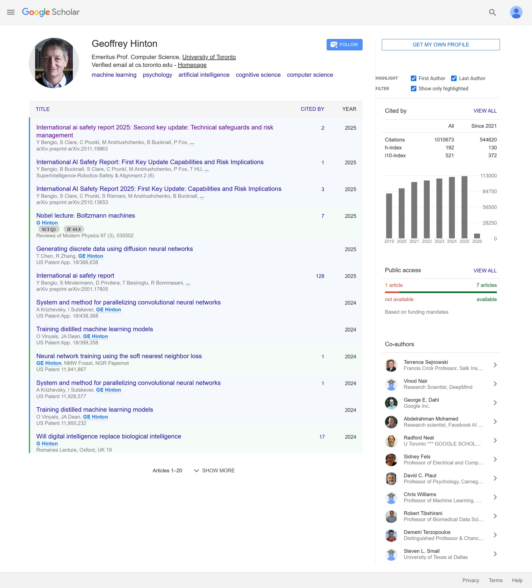

# Scholar Author Pro

[中文](#zh) | [English](#en) | [日本語](#ja)

## ZH
一款谷歌学术个人主页的浏览器插件，能在论文列表中自动高亮该主页学者的姓名，并识别作者的署名位置。

灵感来源于[Google Scholar Author Highlighter](https://chromewebstore.google.com/detail/ijmngekkpaccbbjimedfkjpigplaikah?utm_source=item-share-cb)，但优化了姓名识别逻辑。
本插件所用图标由Flat Icons设计，源自[Flaticon](https://www.flaticon.com/free-icon/scholar_5526482)。

### 功能亮点
*   **姓名高亮**：在论文列表中自动突出显示该学者的姓名，支持带中间名缩写（如"F.M. Last"）、姓名倒序（如"Last First"）等多种变体。
*   **识别一作与尾作**：自动标记第一作者和末位作者的论文，并高亮对应行。
*   **论文筛选**：支持筛选出仅由该学者担任第一作者或通讯作者的论文。

> [!NOTE]
> 若作者列表因过长被截断（显示为`...`）且该学者姓名被隐藏，插件会高亮省略号并将其视为尾作。

### 效果展示

### 安装步骤
1.  下载本仓库文件。
2.  浏览器访问 `chrome://extensions`（Edge浏览器请访问 `edge://extensions`）。
3.  开启右上角 **开发者模式**。
4.  点击 **加载已解压的扩展程序**，选择插件文件夹即可。

### 使用方法
1.  访问任意谷歌学术个人主页。
2.  通过右侧边栏的控制面板，随时开关高亮功能或筛选论文。

## EN
A browser extension for Google Scholar profile pages that highlights the profile owner's name and identifies authorship positions.

Inspired by [Google Scholar Author Highlighter](https://chromewebstore.google.com/detail/ijmngekkpaccbbjimedfkjpigplaikah?utm_source=item-share-cb), but with improved name identification logic.
Icons used in this extension are created by Flat Icons from [Flaticon](https://www.flaticon.com/free-icon/scholar_5526482).

### Features
*   **Highlights the author's name** in paper lists, including variations such as middle initials (e.g., "F.M. Last"), name inversions (e.g., "Last First").
*   **Identifies First Author and Last Author papers**, with row highlighting.
*   **Filters papers** to show only those where you are the first or last author.

> [!NOTE]
> If the author list is truncated (`...`) and your name is hidden, the extension highlights the ellipsis and treats it as a Last Author match.

### Screenshot
[Demo](#效果展示)

### Installation
1. Download this repository.
2. Go to `chrome://extensions` (or `edge://extensions`).
3. Enable **Developer mode**.
4. Click **Load unpacked** and select the extension folder.

### How to Use
1. Visit a Google Scholar profile page.
2. Use the panel in the right sidebar to toggle highlights or filter papers.

## JA
Google Scholarのプロフィールページで、プロフィール所有者の名前をハイライトし、著者順位を識別するブラウザ拡張機能です。

[Google Scholar Author Highlighter](https://chromewebstore.google.com/detail/ijmngekkpaccbbjimedfkjpigplaikah?utm_source=item-share-cb)にインスパイアされていますが、名前の識別ロジックを改良しています。
使用されているアイコンは、[Flaticon](https://www.flaticon.com/free-icon/scholar_5526482)のFlat Iconsによって作成されました。

### 主な機能
*   **著者名のハイライト**: 論文リスト内の著者名を強調表示します。ミドルネームのイニシャル（例：「F.M. Last」）や姓名の逆転（例：「Last First」）などの表記ゆれにも対応しています。
*   **第一著者・最終著者の識別**: 第一著者（First Author）および最終著者（Last Author）の論文を識別し、行全体をハイライトします。
*   **論文フィルタリング**: 自分が第一著者または最終著者である論文のみを表示するように絞り込むことができます。

> [!NOTE]
> 著者リストが省略（`...`）され、名前が隠れている場合、本拡張機能は省略記号をハイライトし、最終著者として扱います。

### スクリーンショット
[デモ](#效果展示)

### インストール方法
1. 本リポジトリをダウンロードします。
2. `chrome://extensions`（または `edge://extensions`）を開きます。
3. **デベロッパー モード**を有効にします。
4. 「**パッケージ化されていない拡張機能を読み込む**」をクリックし、本拡張機能のフォルダを選択します。

### 使い方
1. Google Scholarのプロフィールページにアクセスします。
2. 右サイドバーのパネルを使用して、ハイライトの切り替えや論文のフィルタリングを行います。
